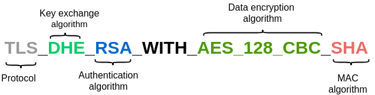

# tls_examples

Implementation of TLS (DTLS) client and server examples

### Dependencies

OpenSSL version 1.1.1

### Build the examples

```shell
LIB_SSL_PATH=<path/to/libssl.so> LIB_CRYPTO_PATH=<path/to/libcrypto.so> make
```
## Secure Sockets Layer/Transport Layer Security

Secure Sockets Layer (SSL)/TLS is the most widely deployed protocol for securing network traffic.
It is widely used for protecting Web traffic and for e-mail protocols such as Internet Message
Access Protocol (IMAP) and Post Office Protocol (POP). TLS is developed for any reliable transport
protocol which maintains the messages’ order. It is typically used for securing TCP applications
(e.g. HTTP).

### Introduction and History
The first SSL version was introduced by Netscape in 1994. In 1995 and 1996, SSL versions 2.0 and 3.0
were released and then came the release of TLS 1.0 which is, in fact, the same as SSL 3.1. Basically,
there is no difference between TLS and SSL, beginning from SSL version 3.1, the protocol name
has been changed to become TLS 1.0. The last standardized TLS version today is 1.2 which
was released in 2008 in RFC5246, moreover, drafts are available for TLS version 1.3. The last
published draft of TLS 1.3 was on 20 March 2018.
The goal of SSL/TLS is to provide the three crucial security services:

- Confidentiality: the data is sent encrypted and only the devices which have the keying material
could decrypt and read the data. The encryption is performed via symmetric encryption
algorithms such as Data Encryption Standard (DES) or Advanced Encryption Standard (AES).

- Integrity: communication partners can detect changes to a message during transmission. this
is achieved using Message Authentication Code (MAC).


- Authentication: the recipient of a message can identify its communication partner and can
detect if the received message has been forged. The authentication is likely based on a
pre-shared key or on client’s and server’s certificates.

TLS is based on a sub-protocol named record layer protocol which on top of it we can find four
protocols, the Handshake protocol, the Change Cipher Spec protocol, the Alert protocol and the
Application Data protocol. Among these four protocols, the most important one is the
Handshake protocol which is used for establishing an authenticated cryptographic secret between
two endpoints by commonly using public key cryptography.


### TLS Handshake
TLS is designed to work on top of a reliable transport protocol typically TCP. It follows the
Client/Server communication model and its goal is to establish a secure connection between a
server and a client and let them exchange data securely across an untrusted network. To establish
a secure connection, the TLS handshake needs to take place. During the handshake, important
messages are exchanged between the client and the server. With the messages exchanged the
client and the server basically agree on the protocol version, select the encryption and the MAC
algorithms, authenticate each other by exchanging and validating digital certificates and share a
symmetric encryption key to be used for encryption.
As standardized in RFC5246, a full SSL/TLS handshake contains the following messages:




- Client Hello: it is the first handshake message and it is sent from the client to the server.
It contains the supported SSL and TLS versions, a random number, a session id and the
supported compression methods and cipher suites. In fact, cipher suites are very important
as they define the key exchange algorithm, the authentication algorithm (digital signature
algorithm), the data encryption algorithm as well as the MAC algorithm.

- Server Hello: upon receiving the Client Hello, the server sends back the Server Hello mes-
sage which contains the selected parameters (key exchange algorithm, the authentication
algorithm...).

- Server Certificate: it is optional to send, it lets the client verify the identity of the server.

- Server Key Exchange: this message is not always present in the handshake, it is only sent if
the server certificate is not sufficient to allow the client to exchange the secret key.

- Certificate Request: it is optional to send, it informs the client to provide its certificate for
authentication.

- Server Hello Done: sent by the server to indicate the end of the Server Hello and the associated
messages (Server Certificate, Server Key Exchange, and Certificate Request). Upon receiving
the Server Hello done, the client verifies the validity of the server certificate and the parameters
selected by the server in the Server Hello.

- Client Key Exchange: it is sent by the client after receiving the Server Hello Done to set the
Pre-master Secret (PMS). The content of this messages depends on the selected key exchange
algorithm, if RSA is chosen, the PMS is encrypted against the server’s public key, however, if
Diffie-Hellman key exchange (DH) is chosen, DH parameters will be sent. The PMS secret
will be used on both sides to compute a shared Master Secret (MS) which will be used for
encryption, decryption and MAC calculation.

- Client Certificate: sent if required by the server, it allows the server to verify the identity of
the client.

- Certificate Verify: if the client sends a certificate with signing ability, a digitally-signed
Certificate Verify message is sent in order to explicitly verify the certificate.

- Change Cipher Spec: sent by both the client and the server. This message indicates that the
following messages will be sent encrypted using the shared keying material.

- Finished: sent by both the client and the server after the Change Cipher Spec message to verify
that the key exchange and authentication processes were successful. It is the last handshake
message and the first encrypted one.

## Datagram Transport Layer Security

A lot of applications today in several domains are delay sensitive and have tight time constraints.
For instance, we can speak of industrial communication, IoT, internet telephony, online gaming and
several other applications. Due to the time constraints, for this kind of applications UDP is used
instead of TCP .


### Introduction and History
Application layer protocols that work on top of TCP such as Hypertext Transfer Protocol (HTTP),
Secure Shell (SSH) or File Transfer Protocol (FTP) can be easily secured using TLS as it is designed
to secure applications working on top of a reliable transport protocol. Unfortunately, for datagram
based applications, no such alternative exists. Therefore, similarly to TLS, DTLS was introduced to
allow the use of the same security services provided by TLS but for datagram based applications.
Over the years, TLS has become more robust and has been refined to withstand numerous attacks
that’s why DTLS was designed to be as similar as possible to it. By minimizing the changes, the risk
of introducing new weaknesses or vulnerabilities will be reduced. Moreover, DTLS implementation
will be easier by reusing TLS pre-existing infrastructure.
The last standardized DTLS version is 1.2, it was standardized in 2012 as RFC6347. Like TLS,
drafts have been published for DTLS version 1.3. The last draft was published on 02 July 2018
.

### DTLS Design
TCP provides a reliable bi-directional tunnel for bytes, where all bytes eventually reach the receiver
in the same order as what the sender used to send them. TCP achieves that through a complex
assembly of acknowledgment messages, transmission timeouts and retransmission. As TLS uses
TCP, it does not encounter issues related to packet loss and reordering which is not the case for
DTLS.
The unreliability of datagram protocols creates problems for TLS in two levels. First, the messages
decryption is dependent from the previous messages as the integrity check is based on the implicit
sequence number. If record N is not received, then the integrity check on record N+1 will be
based on the wrong sequence number and thus will fail. Second, TLS assumes that the handshake
messages are sent reliably, hence, the connection cannot be established if a handshake message is
lost.
In order to handle packet loss, DTLS uses a retransmission timer described in details in RFC6347
. DTLS includes an explicit sequence number which is used for MAC calculation. It is used also
to detect replay attacks and reordering. Furthermore, a new field was introduced named epoch
which is incremented each time a CipherChangeSpec message is sent.
Some TLS cipher suites retain a cryptographic context between records which does not allow to
process individual records. This will cause problems with unreliable protocols, therefore, DTLS
banned the usage of this kind of cipher suites.
TLS and DTLS handshakes are the same except that DTLS has introduced a new message which
does not exist in TLS’s handshake. The new message is named Hello Verify Request, it contains
a cookie and it is sent back to the client just after receiving the Client Hello message. the client
should send back another Client Hello which contains the same cookie. If the cookie is verified
the handshake will continue (same TLS handshake steps), otherwise, the server will close the
connection. The cookie mechanism allows reducing the risk of Denial of Service (DoS) attacks. No
such message exists in TLS handshake because the TCP handshake is established before starting the
TLS handshake which will make the DoS attack difficult. This is not the case for datagram protocols
because no connection is established prior to the DTLS handshake, hence, the cookie mechanism is
needed.
